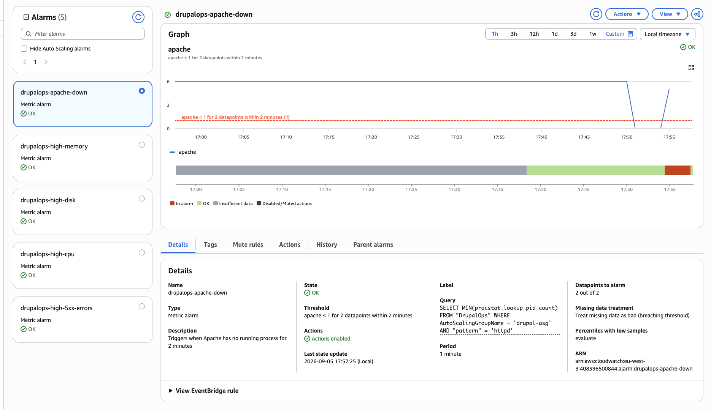

# Terraform Drupal Infrastructure

Terraform infrastructure to deploy a Drupal application on AWS using reusable modules.

## Structure

- `backend.tf`: remote backend configuration for S3 state storage and DynamoDB locking
- `main.tf`: module calls for `compute`, `efs`, `alb`, and `rds`, plus `aws_security_group.web`
- `network.tf`: VPC, public/private subnets, Internet Gateway, route tables, and DB subnet group
- `providers.tf`: Terraform and AWS provider version configuration
- `variables.tf`: global project variables
- `outputs.tf`: global outputs
- `bootstrap/`: bootstrap configuration to create the S3 backend bucket and DynamoDB lock table
- `modules/compute/`: module for the web EC2 instance
- `modules/efs/`: module for EFS
- `modules/alb/`: module for Application Load Balancer
- `modules/rds/`: module for the RDS database
- `scripts/`: install and mount scripts used by `templatefile`

## Prerequisites

- Terraform >= 1.5.0
- AWS CLI configured with valid credentials
- AWS account in the `eu-west-3` region
- S3 backend bucket and DynamoDB lock table for remote state

## Usage

1. Initialize Terraform:
   ```bash
   terraform init
   ```

2. Preview the plan:
   ```bash
   terraform plan
   ```

3. Apply the changes:
   ```bash
   terraform apply
   ```

If the remote backend bucket or DynamoDB lock table does not exist yet, use the bootstrap configuration first:

```bash
cd bootstrap
tf init
tf apply
```

Then return to the root folder and run `terraform init` again to use the remote backend.

## Modules

- `modules/compute`: manages the web EC2 instance and receives `user_data` via `templatefile`
- `modules/efs`: manages the Elastic File System used by Drupal
- `modules/alb`: manages the Application Load Balancer and target group
- `modules/rds`: manages the RDS instance and its security group

## Observability

The EC2 instances run the CloudWatch Agent and publish custom metrics in the
`DrupalOps` namespace. The `DrupalOps-Overview` dashboard centralizes:

- EC2 CPU, memory, and root disk usage
- Auto Scaling Group capacity
- ALB request count and target 5xx errors
- Apache process count
- recent Apache/PHP and cloud-init logs

CloudWatch alarms monitor high CPU, ALB 5xx errors, memory above 80%, root disk
usage above 80%, and Apache availability. Metrics Insights queries target the
Auto Scaling Group, so monitoring continues when instances are replaced.

### Tested incident: Apache unavailable

A controlled incident was performed by stopping Apache on an ASG instance. The
`procstat_lookup_pid_count` metric dropped from 6 to 0, and the
`drupalops-apache-down` alarm entered `ALARM` after two consecutive one-minute
datapoints. After Apache was restarted, the metric recovered and the alarm
returned to `OK`.



## Notes

- `user_data` is generated from scripts in the `scripts/` folder using `templatefile`
- Default variables are defined in `variables.tf`
- Provider and Terraform versions are pinned in `providers.tf`
- Outputs include ALB DNS name and RDS endpoint

## Suggested commit message

```
refactor(terraform): update README to reflect compute, alb, efs and rds modules
```
